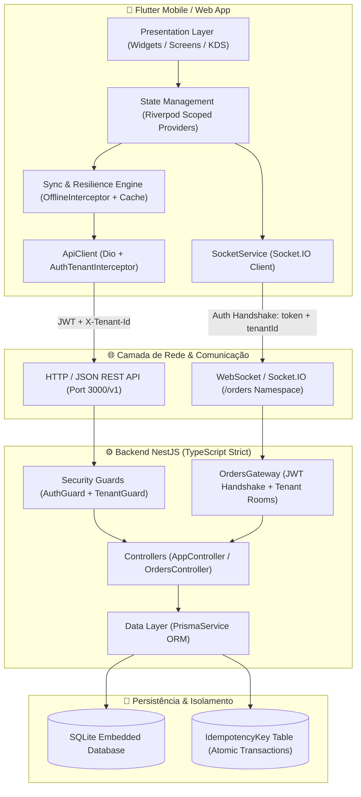

# 🍽️ Comandas — Sistema Operacional de Pedidos Multi-Tenant, Offline-First & KDS Real-Time

[](https://github.com/davigasperin/comandas-multitenant-offline/actions/workflows/ci.yml)
[](https://flutter.dev)
[](https://nestjs.com)
[](https://www.prisma.io)
[](https://www.sqlite.org)
[](https://socket.io)
[](https://blog.cleancoder.com/uncle-bob/2012/08/13/the-clean-architecture.html)

Sistema de alta performance para gestão de pedidos, comandas de salão e **Kitchen Display System (KDS)** em bares e restaurantes. Projetado sob os princípios de **Clean Architecture**, **isolamento multi-tenant real em camadas**, **tolerância a falhas de rede (Offline-First)** com idempotência durável e **comunicação bidirecional orientada a eventos** via WebSockets.

---

## 🏛️ Visão Geral da Arquitetura

O ecossistema combina um cliente mobile/web reativo em Flutter a um backend robusto em NestJS desacoplado por camadas, garantindo isolamento estrito entre empresas e sincronização em tempo real para a equipe de salão e cozinha.



---

## ⚡ Pilares de Engenharia & Decisões de Arquitetura

### 1. 🛡️ Isolamento Multi-Tenant em Camadas (Defense-in-Depth)
Em sistemas SaaS para restaurantes, vazamento de dados entre CNPJs distintos é uma falha crítica. A segurança é aplicada em três barreiras invioláveis:
- **Camada de Transporte (Cliente):** O interceptor `AuthTenantInterceptor` injeta automaticamente o JWT e o cabeçalho `X-Tenant-Id` armazenado em hardware seguro (`FlutterSecureStorage`).
- **Camada de Autorização (Backend):** O `TenantGuard` extrai o `sub` do JWT validado e consulta atomicamente o relacionamento `UserTenant`. Se o usuário não pertencer àquele tenant, a requisição é abortada imediatamente com `403 Forbidden`.
- **Prevenção de Leaks em Memória:** Ao trocar de estabelecimento no app, todo o grafo de dependências do Riverpod é invalidado (`ref.invalidate()`) e o socket desconectado e reinicializado para a nova sala do tenant.

### 2. 🍳 Kitchen Display System (KDS) & Event-Driven Real-Time
A comunicação entre garçom e cozinha opera em tempo real sem sobrecarregar o servidor com polling excessivo:
- **WebSocket Gateway com Rooms:** O `OrdersGateway` do NestJS autentica o cliente no handshake via JWT e inscreve o socket exclusivamente na *room* do seu `tenantId`.
- **Transição Sequencial e Atômica de Status:** Transições de estado seguem a máquina de estados finita:
  $$\text{open} \longrightarrow \text{sentToKitchen} \longrightarrow \text{delivered} \longrightarrow \text{closed}$$
  Regressões ou saltos de estado são rejeitados pelo backend.
- **KDS Responsivo (Flutter):** Interface dividida em 3 colunas (**Novos**, **Em preparo**, **Prontos**) com cronômetro dinâmico de tempo de espera, badges visuais de SLA e botões de avanço de status desabilitados em modo offline.
- **Fallback Híbrido:** Caso o tablet da cozinha perca a conexão WebSocket, um timer de 30 segundos realiza sincronização REST automática como mecanismo de contingência.

### 3. 📶 Resiliência Offline-First (Wi-Fi de Bar Instável)
Em horários de pico, a rede local frequentemente oscila. A arquitetura trata a instabilidade através de:
- **Cache Determinístico de Leitura:** Respostas dos endpoints `/orders`, `/orders/:id` e `/orders/products` são serializadas localmente no `SharedPreferences` com chaves escopadas por `[userId, tenantId, path, queryParams]`. Em timeout ou erro de rede, o interceptor resolve o payload do cache marcando a resposta com `extra: {'offline': true}`.
- **Continuidade de Leitura:** Quando a rede falha, consultas elegíveis são resolvidas pelo cache local, permitindo consultar comandas já sincronizadas.

### 4. 🔒 Motor de Idempotência Distribuída com Hash de Payload
Falhas transitórias de rede podem induzir cliques duplos do operador ou reenvios duplicados de pedidos:
- Cada mutação carrega o cabeçalho `X-Idempotency-Key`.
- O backend calcula o hash SHA-256 do corpo da requisição e grava o resultado da transação na tabela `IdempotencyKey`.
- Caso a mesma chave seja enviada com o mesmo payload, o backend retorna a resposta persistida com custo computacional mínimo.
- Se a mesma chave for reutilizada com payload diferente (conflito de intenção), o backend rejeita a operação com `HTTP 409 Conflict`.

### 5. 🖨️ Impressão Térmica de Recibos (80mm) via Spooler do SO
- **Arquitetura Desacoplada de Hardware:** Em vez de depender de drivers ESC/POS proprietários ou pareamentos Bluetooth instáveis que travam o app, o sistema gera o cupom fiscal/gerencial em padrão térmico de 80mm (`roll80`) delegando a emissão para o spooler nativo do sistema operacional (`printing` / `pdf`).
- Compatível imediatamente com impressoras de rede (TCP/IP), Bluetooth, USB e emuladores de terminal de mesa.
- Cabeçalho dinâmico com identificação visual do estabelecimento e formatação tabular alinhada.

### 6. 💎 Tipagem Estrita e Clean Architecture
- **Backend NestJS:** TypeScript configurado com `strictNullChecks: true`, `noImplicitAny: true` e persistência via **Prisma ORM**, substituindo stores voláteis em memória por SQLite com migrações versionadas.
- **Frontend Flutter:** Camadas estritamente segregadas em `core/` (infraestrutura, tema, rede, interceptors) e `features/` (auth, tenant, dashboard, orders), com modelos estendendo `Equatable` e injeção de dependências declarativa via `Riverpod`.

---

## 📊 Matriz de Decisões de Engenharia (Trade-Offs & ADRs)

| Decisão Técnica | Alternativa Avaliada | Por que escolhemos nossa solução? |
| :--- | :--- | :--- |
| **Prisma + SQLite** | PostgreSQL Server / MongoDB | Zero overhead de infraestrutura para desenvolvimento e implantação local, mantendo migrations SQL estritas; PostgreSQL é o próximo passo para escala multi-instância. |
| **Socket.IO Gateway** | WebSockets Nativo / SSE | Suporte integrado a *rooms* por tenant, reconexão automática com buffer de eventos e fallback transparente para long-polling em redes corporativas com bloqueio de WS. |
| **Riverpod 2.x** | BLoC / Provider / MobX | Compile-time safety para injeção de dependências, `autoDispose` nativo para limpeza de memória após fechar telas e override simples para testes de widget. |
| **Spooler Nativo de Impressão** | Drivers ESC/POS via Raw BLE | Evita crashes de Bluetooth no Android/iOS, suporta impressoras de rede via IP e permite visualização prévia de impressão nativa em modo Web/Desktop. |

---

## 🗂️ Estrutura do Repositório

```text
comandas_app/
├── lib/
│   ├── core/
│   │   ├── constants/            # URLs base, chaves de storage seguro e headers
│   │   ├── errors/               # Exceções de domínio tipadas (ApiException)
│   │   ├── network/              # ApiClient, Interceptors, SyncService e SocketService
│   │   └── theme/                # Tokens de design system (alto contraste para salão)
│   ├── features/
│   │   ├── auth/                 # Autenticação JWT, login e SessionGate
│   │   ├── tenant/               # Seleção e troca dinâmica de estabelecimento
│   │   ├── dashboard/            # Shell principal com tabs e atalhos operacionais
│   │   └── orders/               # Comandas, pedidos, catálogo, recibo PDF e tela KDS
│   └── main.dart
│
├── backend/
│   ├── prisma/
│   │   ├── migrations/           # Histórico versionado de migrações SQL
│   │   ├── schema.prisma         # Modelagem relacional (User, Tenant, Order, Idempotency)
│   │   └── seed.ts               # Carga inicial determinística de desenvolvimento
│   ├── src/
│   │   ├── app.controller.ts     # Endpoints de autenticação e tenants
│   │   ├── orders.controller.ts  # CRUD de pedidos, itens e PATCH status atômico
│   │   ├── orders.gateway.ts     # Gateway WebSocket com auth e salas de tenant
│   │   ├── prisma.service.ts     # Ciclo de vida do banco e conexão Prisma
│   │   ├── *.guard.ts            # Guards de Auth e Tenant Isolation
│   │   └── idempotency.test.ts   # Bateria de testes de idempotência e concorrência
│   └── tsconfig.json             # Compilador TypeScript com checagens estritas
│
└── test/
    ├── features/                 # Testes unitários e de widget (Auth, Orders, KDS, Recibo)
    └── mocks/                    # Mocks de rede e armazenamento seguro para testes
```

---

## 🔌 Catálogo de Endpoints & Eventos

### API REST (`/v1`)

| Método | Rota | Cabeçalhos Obrigatórios | Descrição |
| :---: | :--- | :--- | :--- |
| `POST` | `/auth/login` | — | Autentica usuário e retorna JWT e dados básicos da sessão |
| `GET` | `/me/tenants` | `Authorization: Bearer <token>` | Lista estabelecimentos vinculados ao usuário logado |
| `GET` | `/orders` | `Authorization`, `X-Tenant-Id` | Lista comandas do tenant (suporta filtro `?status=open,delivered`) |
| `POST` | `/orders` | `Authorization`, `X-Tenant-Id`, `X-Idempotency-Key` | Abre comanda/mesa com garantia de não duplicação |
| `GET` | `/orders/products` | `Authorization`, `X-Tenant-Id` | Retorna catálogo de produtos e preços do tenant ativo |
| `GET` | `/orders/:id` | `Authorization`, `X-Tenant-Id` | Obtém detalhe completo e itens de uma comanda |
| `POST` | `/orders/:id/items` | `Authorization`, `X-Tenant-Id`, `X-Idempotency-Key` | Lança item em comanda aberta, validando produto e preço do tenant |
| `PATCH` | `/orders/:id/status` | `Authorization`, `X-Tenant-Id`, `X-Idempotency-Key` | Avança status do pedido (`open` $\rightarrow$ `sentToKitchen` $\rightarrow$ `delivered`) |
| `POST` | `/orders/:id/close` | `Authorization`, `X-Tenant-Id`, `X-Idempotency-Key` | Fecha comanda bloqueando qualquer inclusão posterior |

### Eventos WebSocket (`Namespace: /orders`)

- **Autenticação no Handshake:** `{ auth: { token: "<jwt>", tenantId: "<id>" } }`
- **`order:created`**: Emitido ao abrir uma nova comanda no salão.
- **`order:updated`**: Emitido ao adicionar itens, alterar status ou fechar a comanda; o KDS refaz a consulta REST para obter o estado atual.

---

## 🚀 Como Executar Localmente

### Pré-requisitos
- **Flutter SDK** `>= 3.3.0`
- **Node.js** `>= 20.x` e **npm**

### 1. Inicializar o Backend (NestJS + Prisma SQLite)
```bash
# Navegar até a pasta do backend
cd backend

# Instalar dependências
npm install

# Criar configuração local; JWT_SECRET deve ter pelo menos 32 bytes
cp .env.example .env

# Executar migrações do banco SQLite
npx prisma migrate deploy

# Em atualização de banco legado, converter senhas plaintext explicitamente uma vez
npm run migrate:passwords

# Popular dados de demonstração; defina SEED_USER_PASSWORD no ambiente
npm run prisma:seed

# Iniciar servidor em modo de desenvolvimento
npm run start:dev
```
> O servidor iniciará em `http://localhost:3000`
> **Credenciais de teste:** Usuário: `demo@comandas.com` | Senha: `password123`

### 2. Executar Testes do Backend
```bash
npm run test:idempotency
```

### 3. Iniciar o Aplicativo Flutter
```bash
# Na raiz do projeto
flutter pub get

# Executar em Chrome (Web) ou Emulador Android/iOS
flutter run -d chrome
```

---

## 🧪 Estratégia de Testes & Qualidade Contínua (CI/CD)

O pipeline do **GitHub Actions** (`.github/workflows/ci.yml`) valida cada pull request e push na branch `main`:

```text
[Pipeline de CI]
├── Flutter Job:
│   ├── dart format (padronização de código)
│   ├── flutter analyze (análise estática estrita com 0 warnings)
│   └── flutter test (18 testes de widget, domínio, persistência e KDS)
└── NestJS Job:
    ├── TypeScript strict build (tsc)
    ├── prisma migrate deploy (validação de esquema de banco de dados)
    └── npm run test:idempotency (testes de concorrência, idempotência e WebSockets)
```

Para rodar toda a suíte de testes do app localmente:
```bash
flutter analyze
flutter test
```

---

## 👨‍💻 Autor & Arquitetura
Projeto desenvolvido por **Davi Gasperin** como demonstração de arquitetura sênior, sistemas distribuídos resilientes a falhas de conectividade e engenharia de software de ponta a ponta.
